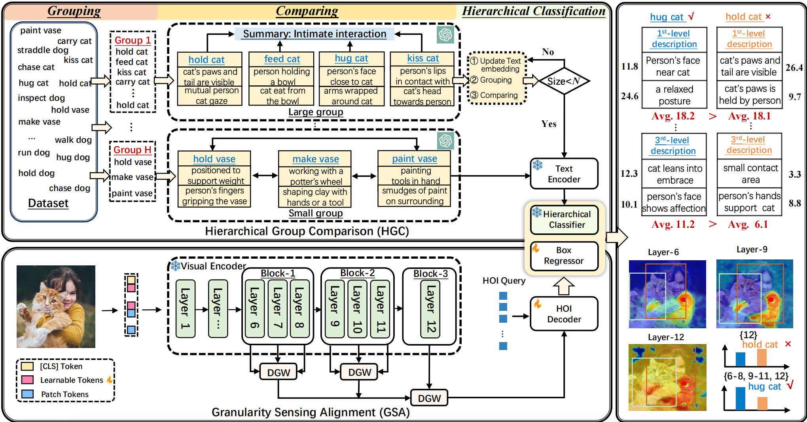

# SGC-Net: Stratified Granular Comparison Network for Open-Vocabulary HOI Detection.
Pytorch Implementation of the framework **SGC-Net** proposed in our paper [Toward Stratified Granular Comparison Network for Open-Vocabulary HOI Detection.](https://arxiv.org/pdf/2503.00414)

## Overview
**Abstract:** Recent open-vocabulary human-object interaction (OV-HOI) detection methods primarily rely on large language model (LLM) for generating auxiliary descriptions and leverage knowledge distilled from CLIP to detect unseen interaction categories. Despite their effectiveness, these methods face two challenges: (1) feature granularity deficiency, due to reliance on last layer visual features for text alignment, leading to the neglect of crucial object-level details from intermediate layers; (2) semantic similarity confusion, resulting from CLIP's inherent biases toward certain classes, while LLM-generated descriptions based solely on labels fail to adequately capture inter-class similarities. To address these challenges, we propose a stratified granular comparison network. First, we introduce a granularity sensing alignment module that aggregates global semantic features with local details, refining interaction representations and ensuring robust alignment between intermediate visual features and text embeddings. Second, we develop a hierarchical group comparison module that recursively compares and groups classes using LLMs, generating fine-grained and discriminative descriptions for each interaction category. Experimental results on two widely-used benchmark datasets, SWIG-HOI and HICO-DET, demonstrate that our method achieves state-of-the-art results in OV-HOI detection. 



## Preparation

### Installation

Our code is built upon [CLIP](https://github.com/openai/CLIP). This repo requires to install [PyTorch](https://pytorch.org/get-started/locally/) and torchvision, as well as small additional dependencies.

```bash
conda create -n SGC-Net python==3.10
conda activate SGC-Net
pip install torch==1.12.1+cu113 torchvision==0.13.1+cu113 torchaudio==0.12.1 --extra-index-url https://download.pytorch.org/whl/cu113
pip install -r requirements.txt
```

### Dataset

The experiments are mainly conducted on **HICO-DET** and **SWIG-HOI** dataset. We follow [this repo](https://github.com/YueLiao/PPDM) to prepare the HICO-DET dataset. And we follow [this repo](https://github.com/scwangdyd/large_vocabulary_hoi_detection) to prepare the SWIG-HOI dataset.

#### HICO-DET

HICO-DET dataset can be downloaded [here](https://drive.google.com/open?id=1QZcJmGVlF9f4h-XLWe9Gkmnmj2z1gSnk). After finishing downloading, unpack the tarball (`hico_20160224_det.tar.gz`) to the `data` directory. We use the annotation files provided by the [PPDM](https://github.com/YueLiao/PPDM) authors. We re-organize the annotation files with additional meta info, e.g., image width and height. The annotation files can be downloaded from [here](https://drive.google.com/open?id=1lqmevkw8fjDuTqsOOgzg07Kf6lXhK2rg). The downloaded files have to be placed as follows. Otherwise, please replace the default path to your custom locations in [datasets/hico.py](./datasets/hico.py).

``` plain
 |─ data
 │   └─ hico_20160224_det
 |       |- images
 |       |   |─ test2015
 |       |   |─ train2015
 |       |─ annotations
 |       |   |─ trainval_hico_ann.json
 |       |   |─ test_hico_ann.json
 :       :
```

#### SWIG-DET

SWIG-DET dataset can be downloaded [here](https://swig-data-weights.s3.us-east-2.amazonaws.com/images_512.zip). After finishing downloading, unpack the `images_512.zip` to the `data` directory. The annotation files can be downloaded from [here](https://drive.google.com/open?id=1GxNP99J0KP6Pwfekij_M1Z0moHziX8QN). The downloaded files to be placed as follows. Otherwise, please replace the default path to your custom locations in [datasets/swig.py](./datasets/swig.py).

``` plain
 |─ data
 │   └─ swig_hoi
 |       |- images_512
 |       |─ annotations
 |       |   |─ swig_train_1000.json
 |       |   |- swig_val_1000.json
 |       |   |─ swig_trainval_1000.json
 |       |   |- swig_test_1000.json
 :       :
```
## Build Discriminative Descriptions

Run this command to generate fine-grained descriptions for HICO-DET/SWIG-HOI dataset or download from [here]().

``` bash
python tools/build_tree.py
```


## Training

Run this command to train the model in HICO-DET/SWIG-HOI dataset

``` bash
bash train.sh --dataset_file ...
```


## Inference

Run this command to evaluate the model on HICO-DET/SWIG-HOI dataset

``` bash
bash test.sh --dataset_file ...  --pretrained ...
```


## Models

| Dataset  | Unseen | Seen  | Full  | Ckeckpoint |
|:----------:|:--------:|:-------:|:-------:|:-------------:|
| HICO-Det | 23.27  | 28.34 | 27.22 |  [params]() |


| Dataset  | Non-Rare | Rare  | Unseen | Full  | Ckeckpoint |
|:--------:|:--------:|:-----:|:------:|:-----:|:-----------:|
| SWIG-HOI | 23.67    | 16.55 | 12.46  | 17.20 |[params]()   |


## Acknowledgments 
We would like to acknowledge the authors of the following repositories from where we borrowed some code
+ [Lei's repository](https://github.com/ltttpku/CMD-SE-release)
+ [Wang's repository](https://github.com/scwangdyd/promting_hoi) 

